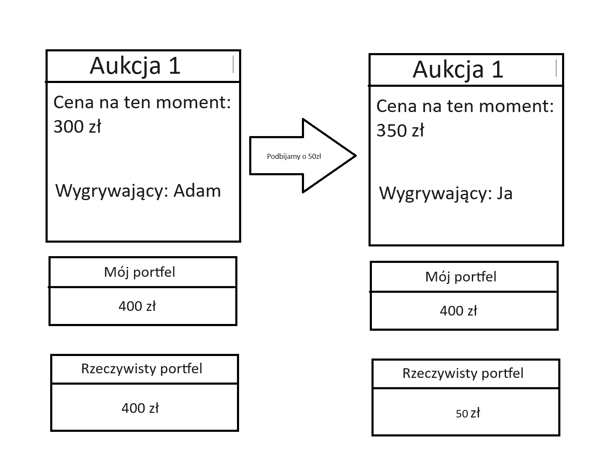
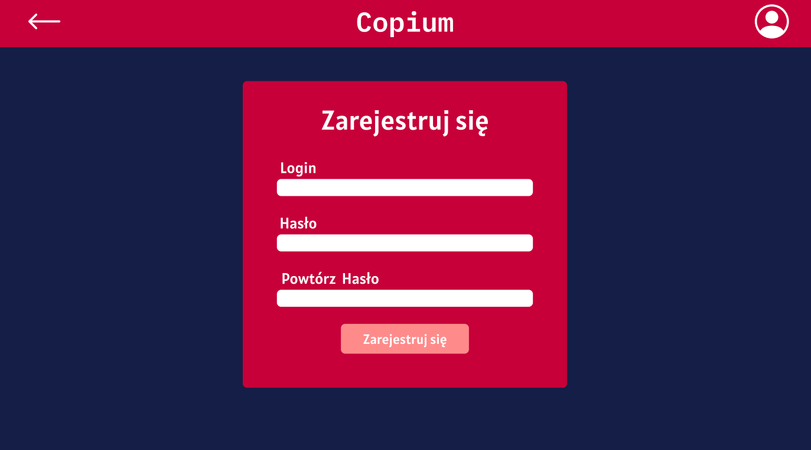
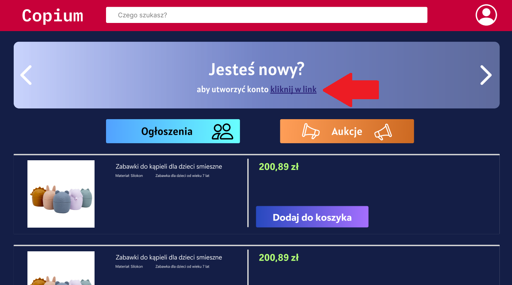
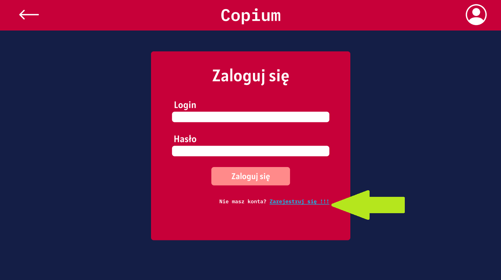

# Funkcjonalność

Główne działania strony to możliwość wstawiania ogłoszeń i organizowanie aukcji.

Serwery strony będą przechowywać konta użytkowników, aukcje, ogłoszenia, zdjęcia.

<h2>Aukcje</h2>

Aukcje są wystawiane w zakładcę aukcję i nie są związane z ogłoszeniami.

Aukcja musi mieć wyznaczony:

* Czas - okres trwania aukcji.
* Cena wejściowa - min. 10zł.
* Cena akutualna
* Nazwę, opis i zjęcie obiektu wystawianego.
* Właściciela aukcji.
* Typ aukcji - czy cena jest stała czy może się zwiększać.

Jeżeli typ aukcji to "Aukcja licytacyjna" to:

* Ma określoną długość czasową
* Zamiast opcji kupna jest opcja podbicia ceny
* Po minięciu czasu, aukcja jest przypisywana do konta i jest z niego pobierana kwota podana przez użytkownika.

**Uwaga**
Stan konta po wzięcu udziału w aukcji nie zmiania się, lecz jest zapisywana kwota w "rzeczywistym portfelu" która wynosi: Stan konta - podbita cena. Ten zabieg słuzy zapobieganiu przypadką w których, użytkownik chce wziąć udział w aukcji, ale nie ma pieniędzy do podbicia na ten moment, bo są obiecane w innej aukcji.

Do funkcji obiektu aukcji zalicza się:

* Po kliknięciu jest przekierowanie do podstrony obiektu.
* Pod obiektem jest sekcja komentarzy.
* Wypisywany jest wygrywający aukcję.
* Po zakończeniu aukcji nie można już wziąć udziału w niej, dać komentaż, a dla osoby która wygrała aukcję jest przypisywana ta aukcja i jest pobierana z konta opłata.
<h2>Konta</h2>

Konta to zbiory danych użytkownika obejmujące:
* Dane osobowe (Imię, nazwisko, wiek, płeć)
* Dane kontaktowe (email, telefon)
* Detale płatnicze (adres, formy doładowania konta)
* Aukcje wygrane i wystawione (id)
* Ogłoszenia wystawione (id)
* Wirtualy portfel (stan konta, waluta, nominał)
* Hasło

Konta są tworzone na stronie rejestracji...

...do której można sie dostać stroną logowania lub stroną główną za pomocą linku w głównym sliderze.

Konta użytkowników są przechowywane w bazie i część danych jest wyświetlana w panelu konta użytkownika.

<h2>Ogłoszenia</h2>

Ogłoszenia są wystawiane w zakładcę ogłoszenia i nie są związane z aukcjami.

Ogłoszenia muszą mieć wyznaczone:
* Tytuł ogłoszenia
* Treść ogłoszenia
* (Opcjonalne) Zdjęcie
* Data wygaśnięcia ogłoszenia

Ogłoszenia automatycznie mają wyznaczone i wyświatlane przy kliknięciu:
* Date wystawienia ogłoszenia
* Liczbę komentarzy
* Liczbę zainteresowanych(forma polubień)

Ogłoszenia w bloku HTML'owskim wyświatlane mają:
* Liczbę komentarzy
* Liczbę zainteresowanych
* Datę wygaszenia ogłoszenia
* Zdjęcie (w przypadku braku zdjęcia, brak obiektu img)
* Tytuł i część opisu

<h2>Portfel</h2>

Informacje dotyczące stanu portfela znajdują się w panelu użytkownika.

Portfel ma daną ilość środków wyświatlanych nie na bierząco (jeżeli bierzemy udział w aukcji, pieniądze wstawione do niej nie są wyświatlane na naszym koncie).

W panelu jest opcja zasilenia portfela dowolną z obsługiwanych przez stronę walut, które są potem przeliczane na walutę używaną w portfelu.

<h2>Sekcja komentarzy</h2>

Ogłoszenia i aukcje posiadają sekcję komentarzy, której komentarze są zapisywane w tej samej kolekcji co aukcja lub kolejno, ogłoszenie.

Komentarze zawierają:

* Użytkownika (który napisał komentarz)
* Datę wystawienia komentarza
* Treść komentarza

Ograniczenie wielkości komentarzy to 400 znaków.

